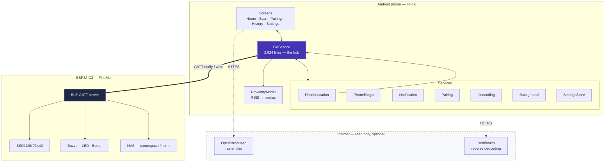
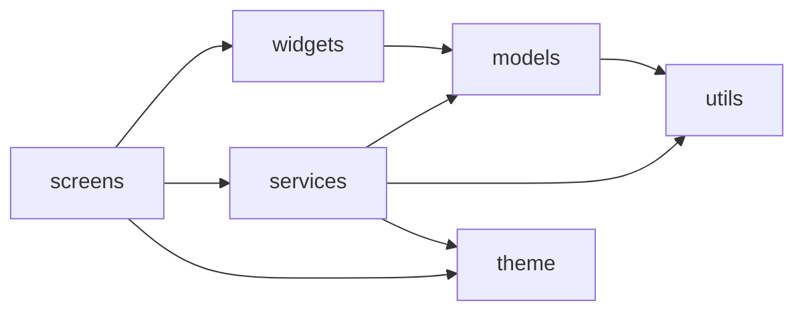
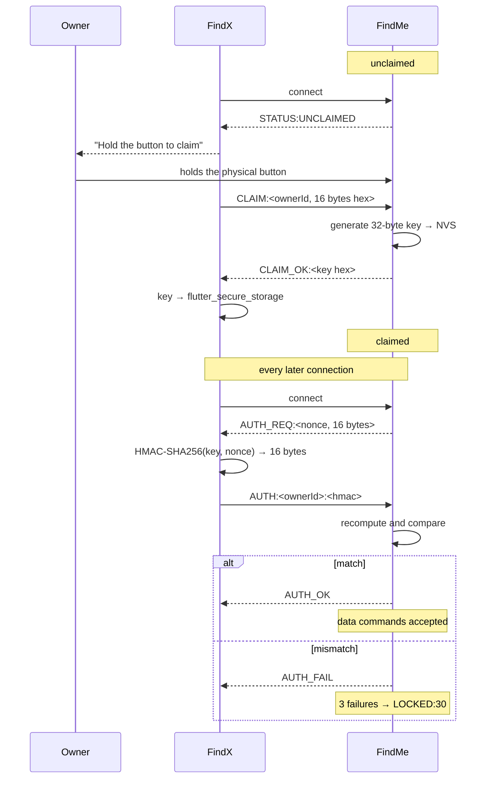
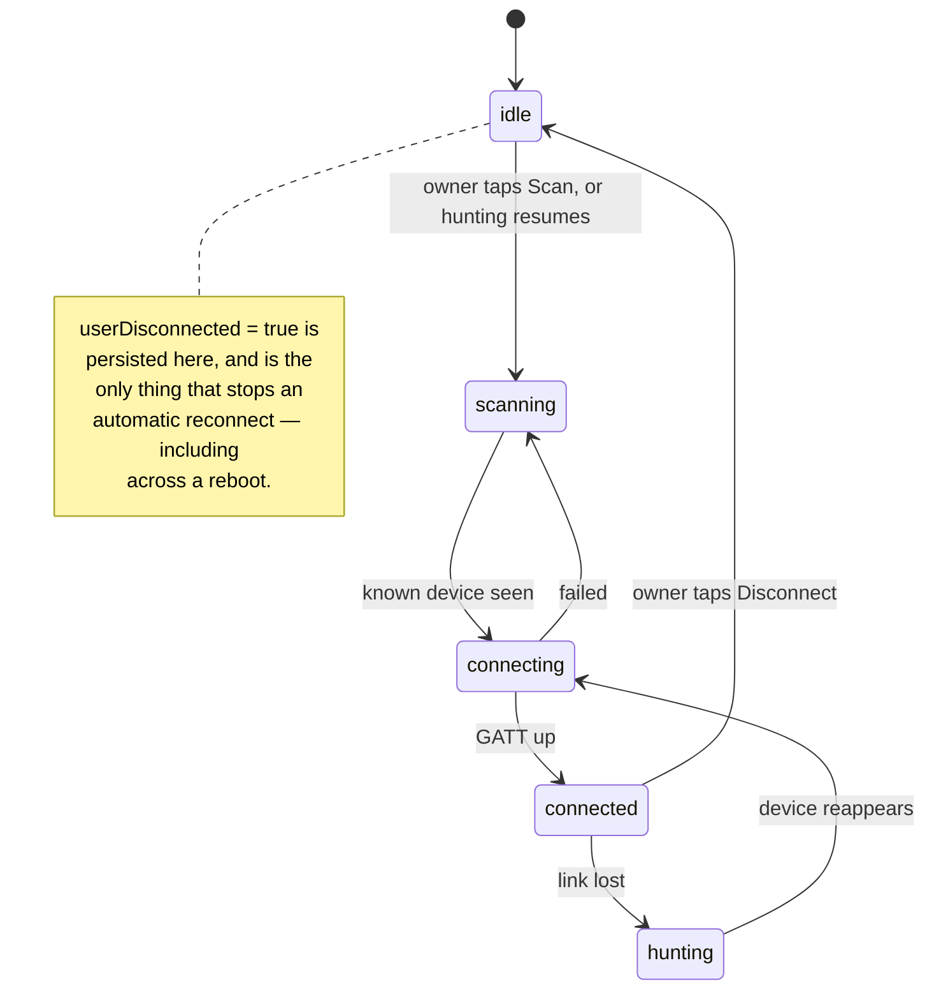
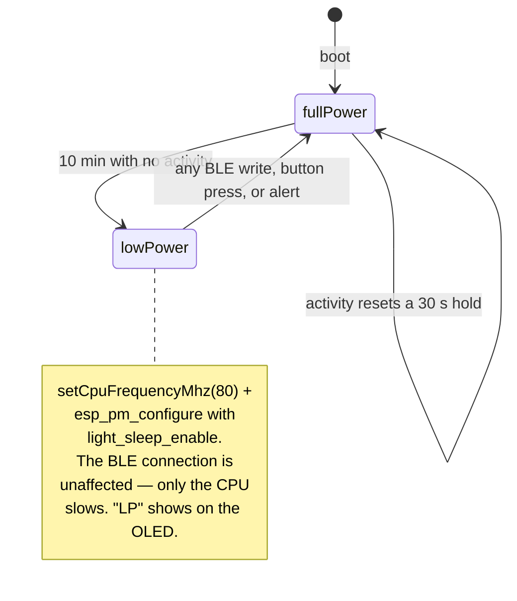
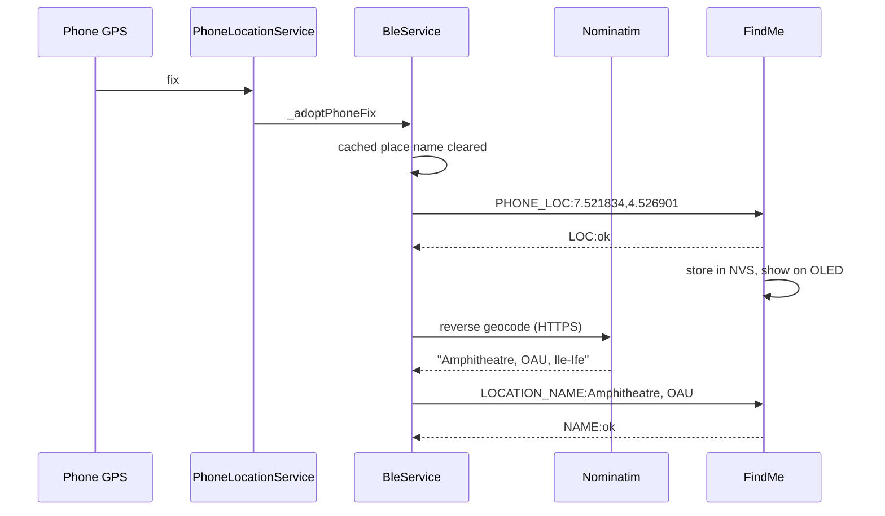
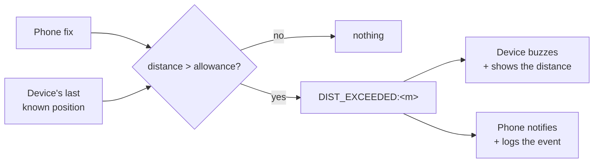
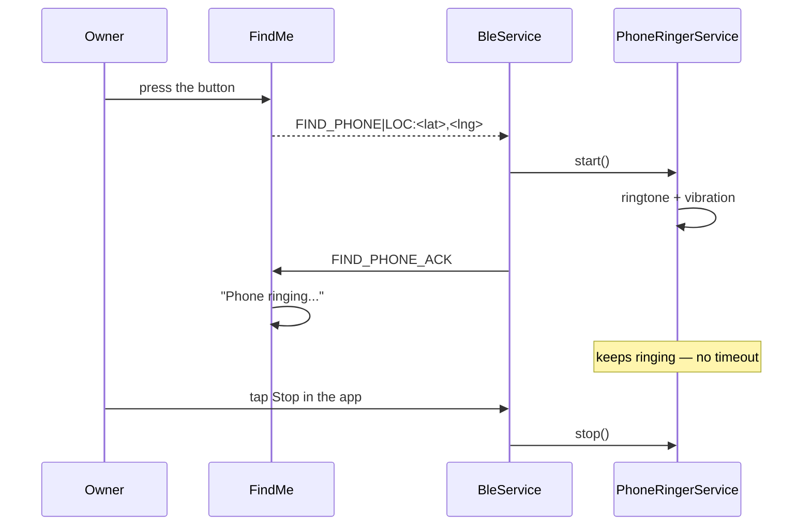
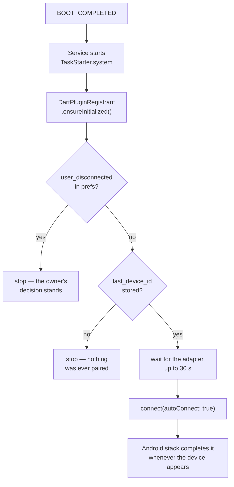

# FindX / FindMe — codebase architecture

A reference for the code as it stands, not as it was planned. Every figure here
was read off the source or the test suite; where something is deliberately
absent, that is said rather than left for you to wonder about.

| | |
|---|---|
| **App** | FindX — Flutter, `1.0.0+1`, Android (iOS builds but cannot run in the background) |
| **Device** | FindMe — ESP32-C3 Super Mini with an on-board 0.42″ SSD1306 OLED |
| **Link** | Bluetooth Low Energy, GATT. No Wi-Fi, no cloud, no account |
| **Dart source** | 15,306 lines across 42 files in `lib/` |
| **Tests** | 145, in 11 files under `test/` |

---

## 1. System architecture



The dashed box is the only part that touches a network, it is read-only, and
the app is fully functional without it: no tiles and no place names, but every
alert, every alarm and every log entry still work.

### What is deliberately not here

- **No GPS receiver in the keyholder.** It was designed in and taken out. A
  receiver inside the keyholder can only be read while a BLE link is up, which
  is precisely not the case at the moment the keys are left behind. The phone's
  receiver *is* available then. Positions therefore travel phone → keyholder.
- **No Wi-Fi and no cloud.** Wi-Fi and BLE share one antenna on the C3;
  coexistence roughly doubles average current. A key finder holding the owner's
  Wi-Fi password and publishing their movements is also a far larger thing to
  secure than one that holds neither.
- **No account and no server.** There is nothing to breach and nothing to
  subpoena. Ownership is a 32-byte secret held by two devices.

---

## 2. Module map

### `lib/services/` — 7,867 lines

| File | Lines | Responsibility |
|---|---|---|
| `ble_service.dart` | 2,924 | The hub. Scanning, connection, GATT I/O, ownership state, event log, every push to the board. The one `ChangeNotifier` the UI listens to. |
| `phone_ringer_service.dart` | 550 | Rings *this* phone when the keyholder's button is pressed. Owns tone choice, vibration, and the "keeps ringing until stopped in the app" rule. |
| `pairing_service.dart` | 504 | The claim/challenge handshake: HMAC-SHA256, nonces, lockout. |
| `ble_protocol.dart` | 352 | **The wire contract.** Every UUID, command and response string. Mirrored by `#define`s in the firmware. |
| `notification_service.dart` | 341 | System notifications and channels. |
| `phone_location_service.dart` | 337 | `geolocator` wrapper: permission ladder, fix stream, background-location upgrade. |
| `background_service.dart` | 344 | Foreground service; survives swipe-away and re-arms the link after a reboot. |
| `owner_identity.dart` | 260 | The owner id and the 32-byte device key, in `flutter_secure_storage`. |
| `settings_store.dart` | 234 | Typed `SharedPreferences` façade. |
| `geocoding_service.dart` | 196 | Nominatim reverse geocoding, with caching and a usage-policy-compliant User-Agent. |
| `proximity_model.dart` | 142 | RSSI → metres. |
| `network_info_service.dart` | 139 | The phone's own IP, for the location card. |
| `ble_vendors.dart` | 128 | Guesses what a nameless radio is from its manufacturer id. |
| `scan_list_diff.dart` | 41 | Keeps the scan list from reordering under the user's finger. |

### `lib/screens/` — 4,627 lines

`settings_screen.dart` (2,074) · `home_screen.dart` (805) · `scan_screen.dart`
(789) · `history_screen.dart` (489) · `pairing_screen.dart` (470)

### `lib/models/` — 807 lines

`event_model.dart` (330) · `ble_device.dart` (121) · `phone_alert_tone.dart`
(110) · `alert_pattern.dart` (108) · `history_retention.dart` (56) ·
`paired_device.dart` (48) · `alert_distances.dart` (34)

### `lib/widgets/` — 2,343 lines

`motion.dart` (355) · `passkey_entry_sheet.dart` (330) · `radar_painter.dart`
(321) · `map_painter.dart` (212) · `map_modal.dart` (189) · `map_tiles.dart`
(169) · `phone_ringing_banner.dart` (117) · `signal_bar.dart` (91) ·
`ownership_badge.dart` (85) · `app_logo_tile.dart` (76) · `battery_pill.dart`
(75) · `section_label.dart` (50)

### Dependency direction



Acyclic, and in one direction only: no service imports a screen, and no model
imports a service. That is what makes the 145 tests possible without a running
app — `ProximityModel`, `EventModel`, `AlertPattern` and `ScanListDiff` are all
pure Dart with no plugin surface.

---

## 3. The BLE protocol

One service, two characteristics — though the hardware in the field implements
only the first.

| | UUID | Properties |
|---|---|---|
| Service | `4fafc201-1fb5-459e-8fcc-c5c9c331914b` | — |
| Data / control | `beb5483e-36e1-4688-b7f5-ea07361b26a8` | read · write · notify |
| Ownership | `beb5483e-36e1-4688-b7f5-ea07361b26a9` | write · notify |

A third characteristic, `…b26aa`, carried Wi-Fi credentials. It is gone from
both sides. The UUID is recorded in a comment in `ble_protocol.dart` and
nowhere else, so it is never reused for something new — a phone still running
the old protocol would write a password to it.

### Phone → device

| Frame | Meaning |
|---|---|
| `FIND_KEY` | Sound the alert. |
| `STOP` | Silence it. |
| `GET_LOC` | Report the last stored position. |
| `ALERT_SET:<token>` | Choose the buzzer cadence: `CONT` or `STEADY`. |
| `PHONE_LOC:<lat>,<lng>` | Where the *phone* is. Six decimals. |
| `LOCATION_NAME:<place>` | What those coordinates are called. |
| `SET_DIST:<metres>` | The maximum allowance. `0` disables it. |
| `DIST_EXCEEDED:<metres>` | The app has measured a breach — sound, and say why. |
| `CLAIM:<ownerId hex>` | Take ownership. Only while the button is held. |
| `AUTH:<ownerId>:<hmac>` | Answer a challenge. |
| `UNCLAIM` | Release ownership. |

### Device → phone

| Frame | Meaning |
|---|---|
| `READY` | Boot complete. |
| `LOC:<lat>,<lng>` | The stored position. |
| `BAT:<percent>` | Battery, or `-1` when the reading is implausible. |
| `FIND_PHONE\|LOC:<lat>,<lng>` | The button was pressed — ring the phone. |
| `ALERT:<token>` | The cadence the device is *actually* using. |
| `AUTH_REQ:<nonce hex>` | Challenge. Answer within 10 s. |
| `AUTH_OK` / `AUTH_FAIL` | Verdict. |
| `LOCKED:<seconds>` | Too many failures. |
| `CLAIM_OK:<32-byte key hex>` | Sent **once**, at the moment of claiming. |
| `DIST_THRESH:<m>` · `DIST_SET:ok:<m>` | The limit the board holds. |
| `LOW_POWER:on` / `off` | Whether the device has dropped its clock. |

### Two dialects, one app

The app's own protocol runs ownership on the second characteristic. **The
hardware actually in the field exposes only the data characteristic** and
announces its claim state on it in plain words: `AUTH:unpaired`,
`AUTH:registered`, `AUTH:ok`, `AUTH:ok_unpaired`, `AUTH:denied`.

That is not a broken device — it is a simpler protocol, and recognising it is
what makes the keyholder's screen work. Until the app learned those strings it
never discovered the claim state, so every data write was withheld as
"possibly unauthenticated", and the board's location page sat on *no fix* while
the app held a perfectly good one.

### Why the MTU is not a detail

```
Default ATT MTU                    23 bytes
  minus 3 bytes ATT write header   20 bytes of payload
"PHONE_LOC:7.521834,4.526901"      27 bytes      ← cannot fit
"CLAIM_OK:" + 64 hex chars         73 bytes      ← cannot fit
```

Both sides must raise it. `BleAuthParams.desiredMtu = 247` in the app;
`BLEDevice::setMTU(247)` in the firmware. Raising only the client does nothing,
which is how the phone's position came to be unreachable by the board for as
long as it was: the app sent a frame it could not have delivered, and nothing
reported an error.

### Anti-stalking property

A claimed keyholder advertises the generic name `FindMe`, identical to every
other unit. Nicknames live in phone preferences keyed by BLE id and are **never
written to the radio**. A passer-by scanning a crowd cannot single out *this*
keyholder, and therefore cannot single out its owner.

The advertised name also has a hard ceiling of 8 characters, held by the
`advertising budget` group in `test/auth_test.dart`:

```
Legacy advertisement           31 bytes
  128-bit service UUID         18
  flags                         3
  AD header for the name        2
  remaining for the name        8      ← "FindMe" is 6
```

A longer name is silently relegated to the scan response by the ESP32 library,
which is why such a device turns up in the scan list as a row with no name.

---

## 4. Ownership and the pairing handshake



The physical button is the root of trust. Claiming requires someone to be
holding the device, which is a far better proof of ownership than any passphrase
a user would actually choose — and it cannot be done remotely, over the air, or
by a neighbour.

| Parameter | Value |
|---|---|
| Owner id | 16 bytes |
| Device key | 32 bytes, generated on the device, transmitted exactly once |
| Nonce | 16 bytes, new per connection |
| HMAC | SHA-256 truncated to 16 bytes (128 bits) |
| Auth timeout | 10 s |
| Lockout | 3 failures → 30 s refusing connections |

The key is never transmitted again after `CLAIM_OK:`. A nonce is new every
connection, so a recorded exchange cannot be replayed.

---

## 5. State machines

### Ownership, as the app sees it

```mermaid
stateDiagram-v2
    [*] --> unknown
    unknown --> unclaimed: STATUS:UNCLAIMED / AUTH:unpaired
    unknown --> claimed: AUTH_REQ: / AUTH:registered
    unclaimed --> authenticated: CLAIM_OK:
    claimed --> authenticated: AUTH_OK / AUTH:ok
    claimed --> denied: AUTH_FAIL / AUTH:denied
    denied --> lockedOut: 3 failures
    lockedOut --> claimed: after 30 s
    authenticated --> unclaimed: UNCLAIM_OK
    authenticated --> unknown: disconnect
```

Only `authenticated` and `unclaimed` permit data writes. The third permitted
case is a board with no ownership characteristic at all: there is no handshake
to complete on such a link, so waiting for one to succeed means waiting
forever.

### Connection lifecycle



### Device power states



---

## 6. Data flow — the three journeys that matter

### Position, phone → device



The name is sent *after* the coordinates and never instead of them: the lookup
needs internet and may never return, and a board told a name but no position
would have nothing to fall back on. Repeated every two minutes while connected,
and again on every reconnect.

Both frames exceed 20 bytes, which is why section 3's MTU note is load-bearing
rather than trivia.

### Maximum allowance breach



The app does the measuring because only the app holds both positions.
`DIST_EXCEEDED:` is kept distinct from `FIND_KEY` on purpose: one means "the
owner pressed a button", the other means "these keys have left the area their
owner allowed". Different text on the screen, different log entry, and only one
of them was asked for at that instant. Both are ended by `STOP`.

### Button press → phone rings



The ringing has no timeout by design. A phone that gives up after ten seconds
is no use to someone still lifting cushions; only an explicit Stop in the app
ends it.

---

## 7. Distance from signal strength

`ProximityModel` implements the log-distance path-loss model:

$$RSSI = TxPower - 10 \cdot n \cdot \log_{10}(d)$$

rearranged for the unknown:

$$d = 10^{\frac{TxPower - RSSI}{10n}}$$

| Constant | Value | Meaning |
|---|---|---|
| `defaultTxPower` | −59 dBm | measured RSSI at exactly 1 m |
| `defaultPathLossExponent` | 2.5 | 2.0 is free space; indoors runs 2.5–4 |
| `maxReportedMetres` | 30.0 | beyond this the estimate is noise |

Readings with `rssi >= 0` or `rssi < -127` are rejected outright — they are
sentinel values from the platform, not measurements.

**This is an estimate and the UI says so.** RSSI varies by several dB from a
hand moving across the antenna, a pocket, or a doorway. Both constants are
owner-adjustable in Settings, because `txPower` in particular is a property of
the individual board and its enclosure. What the model is good for is
*relative* judgement — warmer, colder — which is what finding something in a
room actually requires.

---

## 8. Background operation

The requirement, in the owner's words, was for the app to keep working "like
WhatsApp" — closed, cleared from RAM, and across a reboot.

| Threat to the process | Answer |
|---|---|
| App minimised | A foreground service: a cached process is the first thing Android reclaims. |
| Swiped out of Recents | `stopWithTask: false`, set from Dart rather than the manifest. |
| Android 15's 6-hour cap | `foregroundServiceType="connectedDevice"`, not `dataSync` — which is capped at ~6 h per 24 h. The app genuinely interacts with a connected Bluetooth device, so the accurate type is also the uncapped one. |
| Manufacturer battery managers | `REQUEST_IGNORE_BATTERY_OPTIMIZATIONS`, asked for at runtime. On Xiaomi, Oppo, Vivo and Huawei this is frequently the difference between working and not. |
| Reboot | `autoRunOnBoot: true` plus a headless reconnect — see below. |
| App update | `autoRunOnMyPackageReplaced: true`. |

### One isolate, except at boot

`flutter_foreground_task` can run a second isolate, and that is usually why
people reach for it. Here it is used **only to hold the process open**. Isolates
share no memory, so a `BleService` in a second isolate would be a different
object with a different radio handle from the one the UI is bound to, and the
two would fight over the adapter.

The exception is a start by `TaskStarter.system` — a reboot or an app update.
There is no Activity then and therefore **no main isolate at all**: nothing has
constructed a `BleService`, nothing is scanning, and an empty handler would
mean a phone that restarted overnight had quietly stopped watching. Since there
is nothing to collide with, the handler re-arms the link itself:



`autoConnect: true` rather than a scan, because a reboot is the moment the
keyholder is *least* likely to be in range — the phone may be charging in
another room. A scan would find nothing and give up; the stack holds the request
open at no app-side battery cost. (`mtu` must be `null` alongside it: the
exchange cannot be scheduled for a connection that has not happened yet.)

### The one thing that stops it

A deliberate Disconnect in the app sets `user_disconnected` in preferences,
*before* the radio is touched — because `device.disconnect()` makes the
connection-state listener fire, and that path resumes hunting by default. The
flag has to be standing in front of it.

It is persisted, so it survives a reboot, which is what makes the rule
coherent: **reconnect always, except after a disconnect the owner has not
undone.**

---

## 9. Permissions, and the reason for each

| Permission | Why | Gate |
|---|---|---|
| `BLUETOOTH_SCAN` + `neverForLocation` | Discovery. The flag is a promise that position is never derived from nearby radios, and it is kept: `startScan` passes `androidUsesFineLocation: false`. | install |
| `BLUETOOTH_CONNECT` | GATT. | install |
| `BLUETOOTH` / `BLUETOOTH_ADMIN` | `maxSdkVersion="30"` — replaced by the pair above in API 31. Leaving them unbounded asks modern users for permissions the app cannot use. | install |
| `ACCESS_FINE_LOCATION` | The phone's own GPS, which is the only position in the system. Also gates BLE discovery on Android 11 and below. | runtime |
| `ACCESS_BACKGROUND_LOCATION` | From Android 10 a backgrounded app asking for a position gets nothing back. Requested **separately and after** foreground; on Android 11+ it is not a dialog at all and the owner must be sent to `openAppSettings()`. | runtime, and only when background monitoring is switched on |
| `POST_NOTIFICATIONS` | Proximity and breach warnings. | runtime |
| `FOREGROUND_SERVICE_CONNECTED_DEVICE` | See section 8. | install |
| `RECEIVE_BOOT_COMPLETED` | Reconnect after a reboot. | install |
| `READ_MEDIA_AUDIO` / `READ_EXTERNAL_STORAGE` | A custom ring tone. The system picker needs no permission; these are declared so the request the owner expects actually appears, and a refusal is non-fatal. | runtime |
| `VIBRATE` | A phone under a cushion is found by feel. | install |
| `INTERNET`, `ACCESS_NETWORK_STATE` | Map tiles, reverse geocoding, the address readout. | install |

`usesCleartextTraffic="false"`: nothing here needs plaintext HTTP, so Android
itself blocks any accidental plaintext request.

**Removed, and worth recording as removed:** `NEARBY_WIFI_DEVICES`,
`ACCESS_WIFI_STATE` and `CHANGE_WIFI_STATE`, which existed for Wi-Fi
provisioning. A permission the app no longer exercises is not free — it is
printed on the Play listing and in the system permission screen, and "this key
finder wants to see the networks around you" is a question the owner should not
have to answer for a feature that does not exist.

`FOREGROUND_SERVICE_LOCATION` is deliberately **not** declared. The service
does not read location; the main isolate does, while the service merely keeps
it alive.

---

## 10. Firmware

Two sketches, and the difference matters:

| | Purpose |
|---|---|
| `firmware/findme_device/Myprojctcode.ino` | **What is flashed.** No GPS, two-tone cadence table, single-channel `AUTH:` dialect, light-sleep power management. |
| `firmware/keyguard_esp32c3/keyguard_esp32c3.ino` | The reference sketch for a GPS-equipped variant, with the two-characteristic ownership protocol. Also a **test fixture** — `test/alert_pattern_test.dart:98` reads it from disk and parses the cadence table, so it cannot be deleted. |

### Pin map, as built

| GPIO | Function |
|---|---|
| 5 | OLED SDA — on board |
| 6 | OLED SCL — on board |
| 4 | Status LED, 220 Ω in series |
| 10 | Active buzzer, 3 V |
| 7 | Push button, `INPUT_PULLUP` |
| 1 | Battery sense, via a 1:2 divider |

GPIO 8 and 9 are the boot strapping pins and are left unused.

### Battery measurement

```c
analogReadResolution(12);
analogSetPinAttenuation(BAT_PIN, ADC_11db);
// readBatteryVoltage(): average analogReadMilliVolts, then × BAT_DIVIDER_RATIO (2.0)
```

`batteryPercentage()` returns −1 outside 2.50–4.50 V, because a reading outside
that window is a fault rather than a flat battery and saying "0 %" about it
would be a lie. 100 % at ≥ 4.20 V, 0 % at ≤ 3.00 V, linear between, with ±3 %
hysteresis against the cached value so the digit does not flicker.

The protection IC cuts the cell off near 2.4 V, so the firmware's 0 % at 3.00 V
stops well before the cell is damaged.

### The buzzer is an active element

`digitalWrite` only — never `tone()`. It generates its own tone; driving it with
a PWM frequency produces a thin rattle instead of a loud beep.

### The cadence table

```c
{ "CONT",   60000UL, 0UL, 1, 0UL },
{ "STEADY",   250UL, 0UL, 1, 250UL },
```

`g_cadenceIndex = 1` (STEADY) by default, persisted to NVS. **Row order is
load-bearing** — the index is what is stored, so reordering the table silently
changes what a device already in the field does. `test/alert_pattern_test.dart`
parses this table from disk with a five-group regex, so adding a struct field
breaks the test; that is the test doing its job.

### Frame reassembly

One GATT write carries one frame. The buffer that joins split writes has a
length cap and a 150 ms stale-frame flush, and its completeness test errs
towards obeying a frame immediately.

That bias is deliberate. The earlier version held anything beginning with
`PHONE_LOC:` until a comma appeared and never reset when the comma failed to
arrive — so one truncated frame left `PHONE_LOC:7.52` in the buffer, the next
command was appended to it, the result matched nothing, and the board obeyed no
further command until a reconnect. Holding a frame back to see whether more
arrives is also how a place name ends up stored as `AmphitheatreSET_DIST:50`.

---

## 11. Test suite — 145 tests

| File | Tests | Covers |
|---|---|---|
| `auth_test.dart` | 367 lines | HMAC, nonces, lockout, the 31-byte advertising budget |
| `widget_test.dart` | 208 | App boot, `EventModel` round-trips, retention |
| `phone_location_test.dart` | 199 | Permission ladder, fix plausibility |
| `alert_pattern_test.dart` | 173 | Cadence table parsed **from the firmware on disk** |
| `distance_test.dart` | 336 | Path-loss model, rejection of sentinel RSSI |
| `scan_list_visibility_test.dart` | 169 | Which radios are shown as keyholders |
| `phone_alert_tone_test.dart` | 108 | Tone selection and persistence |
| `scan_list_diff_test.dart` | 97 | List stability under the user's finger |
| `coordinates_test.dart` | 95 | Formatting, hemispheres, the no-fix case |
| `background_service_test.dart` | 54 | Platform gating |
| `error_banner_test.dart` | 45 | Error surfacing |

`alert_pattern_test.dart` is the unusual one and the most valuable: it reads the
firmware source and asserts the app's `AlertPattern` tokens match the device's
cadence table. It is the only thing that can catch the two sides of the wire
contract drifting apart, which is a class of bug no amount of Dart-only testing
would find.

---

## 12. Known limits, stated plainly

**The device cannot be sent an IP address.** The board has no network stack and
no Wi-Fi, and there is no frame for an address in either dialect of the
protocol. The address shown on the Home location card is the *phone's own*, and
it is displayed on the phone only. A place name is in any case strictly more
useful on a 72×40 screen than an IP would be — which is what `LOCATION_NAME:`
is for.

**The keyholder's screen shows where the phone was, not where the keys are.**
That is a consequence of there being no GPS in the device, and it is the right
way round: "where are my keys" is answered by the app; "where was my phone
last" is answered by the little screen, which is the one you can read when the
phone is the thing that is missing.

**Distance is an estimate.** See section 7.

**iOS background operation does not work.** An iOS app is suspended shortly
after backgrounding whatever you do; the only route is the `bluetooth-central`
background mode, which is CoreBluetooth's business and is not implemented here.
Every method in `BackgroundService` is a no-op off Android rather than an error.

**`applicationId` is still `com.example.keyguard`.** It should be changed before
any public release, but changing it breaks the upgrade path for every already
installed APK — so it is flagged here rather than quietly altered.

**The reference sketch has never been compiled in CI.** It is parsed by a test
but not built. A compile check would be worth adding.

---

## 13. Cross-references

- `docs/SECURITY_MODEL.md` — threat model and the reasoning behind the
  ownership design
- `docs/CHAPTER_3_DESIGN.md` — methodology and system design
- `docs/CHAPTER_4_IMPLEMENTATION.md` — implementation, testing and results
- `docs/CHAPTER_5_CONCLUSION.md` — summary, conclusion, recommendations
- `docs/images/circuit_diagram.svg` — the hardware as built
- `firmware/README.md` — flashing, libraries, board settings
