# CHAPTER THREE

# SYSTEM ANALYSIS AND DESIGN

---

## 3.1 Introduction

This chapter sets out how the FindX/FindMe system was analysed, designed and
specified. It begins with the methodology adopted, states the requirements that
the design must satisfy, and then presents the design itself at four levels of
detail: the system architecture, the hardware circuit, the communication
protocol, and the algorithms. Each design decision is given with the reason for
it, including the decisions that reversed an earlier choice — a design document
that presents only the final state hides the information most useful to anyone
extending the work.

The system comprises two deliverables:

- **FindX** — an Android application written in Dart using the Flutter
  framework.
- **FindMe** — a battery-powered Bluetooth Low Energy keyholder built on the
  Espressif ESP32-C3 microcontroller.

---

## 3.2 Research methodology

### 3.2.1 Choice of methodology

An **iterative and incremental** development methodology was adopted, with the
system built in working increments, each tested on real hardware before the next
was begun.

The alternative — a waterfall sequence of complete analysis, complete design,
then implementation — was rejected for a specific reason rather than a
fashionable one. Three of the most consequential findings in this project could
not have been discovered from a specification:

1. That a GPS receiver inside the keyholder is almost useless, because its
   readings can only be retrieved while a Bluetooth link is up, which is
   precisely not the case at the moment the keys are lost.
2. That an advertised Bluetooth name longer than eight characters makes the
   device appear in scan lists with no name at all, because of the 31-byte
   legacy advertisement budget.
3. That the default ATT MTU of 23 bytes leaves only 20 bytes of payload, which
   is fewer than the length of the frame carrying a coordinate pair.

Each was found by building the thing and watching it fail. A methodology that
defers all implementation until the design is frozen would have frozen all three
faults into the design.

### 3.2.2 Development cycle

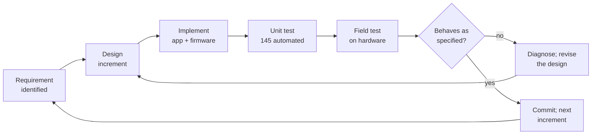

### 3.2.3 Data gathering

| Method | Purpose |
|---|---|
| **Literature review** | Bluetooth Core Specification 5.x (GAP, GATT, ATT MTU); Android foreground-service and background-location documentation; published work on RSSI-based indoor ranging; the unwanted-tracking literature arising from commercial tag deployments. |
| **Analysis of existing products** | Apple AirTag, Tile and Samsung SmartTag were examined for their feature sets and, more importantly, for the privacy failures reported against them. This directly produced the single-advertised-name requirement (§3.3.3). |
| **Empirical measurement** | RSSI was sampled at known distances to fix the path-loss constants. Current draw was measured to size the battery and to justify the low-power mode. |
| **Iterative field testing** | Each increment was exercised on an actual phone and an actual board, including the awkward cases: phone rebooted, app swiped away, device out of range, device in a pocket. |

### 3.2.4 Development environment

| Component | Tool |
|---|---|
| Application framework | Flutter (Dart) |
| Application IDE | Visual Studio Code |
| Firmware | Arduino IDE, ESP32 Arduino core |
| Firmware libraries | `NimBLE`/`BLEDevice` (ESP32 BLE Arduino), `U8g2` for the OLED, `Preferences` for NVS |
| Version control | Git |
| Target platform | Android 8.0 (API 26) and above |
| Test framework | `flutter_test` — 145 automated tests |

---

## 3.3 Requirements analysis

### 3.3.1 Functional requirements

| ID | Requirement |
|---|---|
| FR-1 | Discover nearby FindMe keyholders and display them with signal strength. |
| FR-2 | Connect to a keyholder and maintain the connection. |
| FR-3 | Estimate and display the distance to the keyholder from signal strength. |
| FR-4 | Sound the keyholder's buzzer on demand, and silence it on demand. |
| FR-5 | Ring the phone when the keyholder's button is pressed, and continue ringing until the owner stops it in the app. |
| FR-6 | Let the owner set a **maximum allowance** — a distance past which the keyholder sounds — and a separate, lower **proximity threshold** that only notifies. |
| FR-7 | Push the phone's position to the keyholder for display on its own screen. |
| FR-8 | Resolve that position to a human-readable place name and push that too. |
| FR-9 | Display the keyholder's position on a map, and open it in an external maps application. |
| FR-10 | Report the keyholder's battery level. |
| FR-11 | Maintain a timestamped event log, with the place name and the day. |
| FR-12 | Bind a keyholder to exactly one owner, so that no other phone can use it until it is released. |
| FR-13 | Continue monitoring while the app is in the background, after it is swiped out of Recents, and after the phone is rebooted. |
| FR-14 | Reconnect automatically whenever the keyholder reappears, **except** after a disconnection the owner performed deliberately and has not undone. |
| FR-15 | Allow the alert cadence to be chosen, and have that choice affect the device's buzzer. |
| FR-16 | Allow a per-device nickname, held on the phone only. |
| FR-17 | Have the keyholder conserve power when idle without dropping its connection. |

### 3.3.2 Non-functional requirements

| ID | Requirement | Design response |
|---|---|---|
| NFR-1 | Run on a phone with 3 GB of RAM | Single BLE service instance; bounded event log; no second isolate |
| NFR-2 | Survive aggressive memory management | Foreground service of type `connectedDevice` |
| NFR-3 | Multi-day battery life on a small LiPo | Light sleep at 80 MHz after 10 min idle; BLE-only, no Wi-Fi |
| NFR-4 | No account, no server, no cloud | All state local; two optional read-only HTTPS services |
| NFR-5 | Not usable as a stalking device | One generic advertised name for every unit; nicknames never transmitted |
| NFR-6 | Readable on a 72×40 pixel display | Place names preferred over coordinates; text truncated, never wrapped off-screen |
| NFR-7 | Degrade gracefully with no internet | Map and place names optional; all alerting works offline |
| NFR-8 | Maintainable protocol | One Dart file as the contract, mirrored in firmware, with an automated test comparing them |

### 3.3.3 Requirements derived from the privacy analysis

These are separated out because they constrain the design more tightly than any
functional requirement, and because they are the requirements most often absent
from comparable projects.

| ID | Requirement | Rationale |
|---|---|---|
| PR-1 | A keyholder must advertise **no** per-unit identifier — no serial, no owner id, no nickname, no counter. | A unique identifier on the air makes the device followable by any passer-by with a scanner, and therefore makes its owner followable. |
| PR-2 | Nicknames are stored on the phone, keyed by BLE address, and never written to the radio. | Same reason. The convenience of an identifiable name in a scan list *is* the attack. |
| PR-3 | Ownership must not be transferable over the air. | Prevents remote hijack of a keyholder. |
| PR-4 | The device must hold no credential belonging to any other system. | It is small, frequently lost, and its flash is readable over USB. |
| PR-5 | No movement history leaves the phone. | There is then no operator who could disclose one. |

---

## 3.4 System architecture

### 3.4.1 Overall architecture

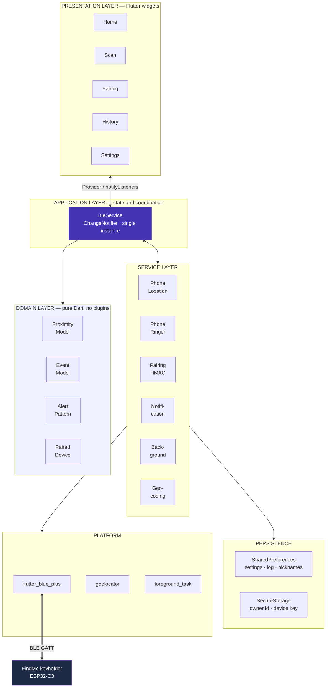

The dependency direction is strictly downward and acyclic: no service imports a
screen, and no domain class imports a service. That is what makes the domain
layer testable without a running application, and it is why 145 tests can run in
a plain Dart VM.

### 3.4.2 Why a single `BleService`

`BleService` is a deliberate hub rather than an accident of growth. A Bluetooth
adapter is a single physical resource, and two objects holding handles to it
produce a class of bug that is extremely hard to diagnose: scans that stop
finding devices, connections that drop when another part of the app disconnects
something else, notifications that arrive at the wrong listener.

The practical consequence appears in §3.4.3.

### 3.4.3 Background execution design

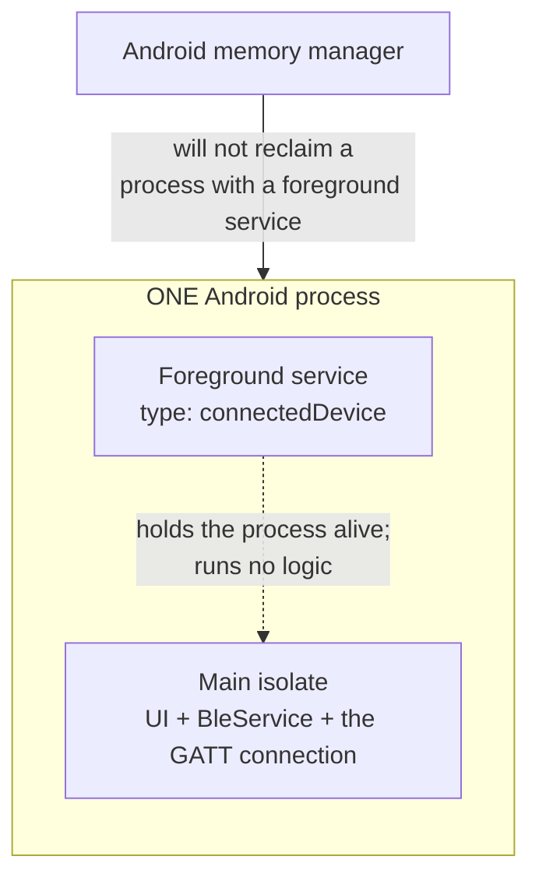

`flutter_foreground_task` is capable of running a **second isolate**, and that is
normally why it is used. It is deliberately not used that way here. Isolates
share no memory, so a `BleService` constructed in a second isolate would be a
*different object* with a *different radio handle* from the one the user
interface is bound to — exactly the two-instance problem of §3.4.2, with an
isolate boundary making it harder to see. The service therefore runs in the same
process and holds it open; Dart timers, stream subscriptions and the native GATT
connection all keep running because nothing ever tore them down.

**The one exception is a reboot.** When Android starts the service from its boot
receiver there is no Activity and therefore no main isolate at all: nothing has
constructed a `BleService`, and an empty handler would mean a phone that
restarted overnight had silently stopped watching. In that single case — and only
that case, discriminated by the platform's own `TaskStarter.system` value — the
handler re-arms the connection itself. The rule of §3.4.2 inverts rather than
bends: there is no other instance to collide with.

### 3.4.4 Deployment view

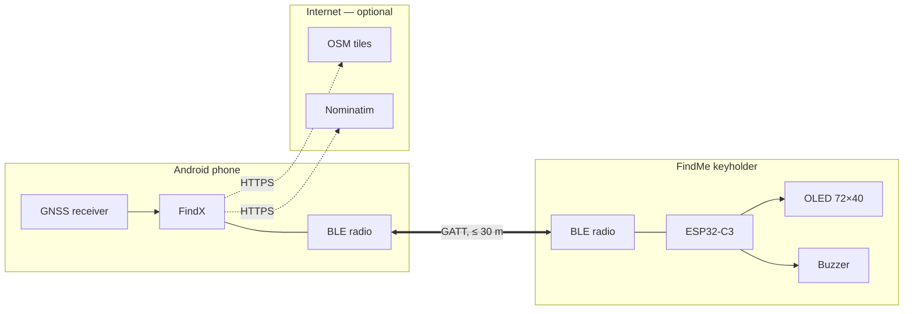

---

## 3.5 Hardware design

### 3.5.1 Component selection

| Component | Part | Why this one |
|---|---|---|
| Microcontroller | ESP32-C3 Super Mini | Integrated BLE 5.0; RISC-V core; deep- and light-sleep support; under 25 × 18 mm; low unit cost. |
| Display | SSD1306 0.42″, 72 × 40, I²C | Already on the chosen board, so no extra wiring and no extra height. Readable, and dark pixels cost nothing. |
| Alert | Active 3 V magnetic buzzer | Self-oscillating, so it needs one GPIO and no PWM timer. Loud enough to find keys under a cushion. |
| Input | Momentary tactile switch | One control, three functions by press duration. |
| Battery | 1S LiPo, 3.7 V | Highest practical energy density for the volume. |
| Charging | TP4056 module with DW01 protection | Correct CC/CV profile for lithium; integrated over-discharge cutoff. |
| Battery sensing | Two 100 kΩ resistors | 1:2 divider; 100 kΩ keeps the quiescent drain to tens of microamps. |

### 3.5.2 Circuit diagram

The full circuit diagram is **Figure 3.1**, at
[`docs/images/circuit_diagram.svg`](images/circuit_diagram.svg).

Schematic summary:

```
                 ┌──────────── ESP32-C3 Super Mini ────────────┐
                 │                                              │
  [SSD1306 OLED] │ GPIO 5 ── SDA  (on board, soldered)          │
  72 × 40, I²C   │ GPIO 6 ── SCL  (on board, soldered)          │
                 │                                              │
      GND ──[LED]┤ GPIO 4 ──[220 Ω]──── status LED ── GND       │
                 │                                              │
      GND ─[BUZZ]┤ GPIO 10 ─────────── buzzer (+) ── GND        │
                 │                                              │
      GND ──[SW]─┤ GPIO 7 ─────────── button ── GND             │
                 │          (INPUT_PULLUP, no external resistor)│
                 │                                              │
                 │ GPIO 1 ◄── ADC1, 12-bit, 11 dB attenuation   │
                 │              ▲                               │
                 │              │  V_bat / 2                    │
                 │       ┌──────┴──────┐                        │
                 │  V_bat┤ R1 100 kΩ   │                        │
                 │       ├─────────────┤── tap → GPIO 1         │
                 │       │ R2 100 kΩ   ├── GND                  │
                 │       └─────────────┘                        │
                 │                                              │
                 │ 5V ◄── TP4056 OUT+ ◄── LiPo 1S 3.7 V         │
                 │ GND ── common ground                         │
                 └──────────────────────────────────────────────┘

                 GPIO 8 and GPIO 9 are boot strapping pins — unused.
```

### 3.5.3 Pin assignment

| GPIO | Direction | Function |
|---|---|---|
| 1 | Analogue in | Battery voltage, via a 1:2 divider |
| 4 | Digital out | Status LED, 220 Ω series |
| 5 | I²C SDA | OLED (on board) |
| 6 | I²C SCL | OLED (on board) |
| 7 | Digital in, pull-up | Push button, active low |
| 10 | Digital out | Active buzzer |

### 3.5.4 Battery measurement design

The cell may reach 4.2 V fully charged, which exceeds the 3.3 V the ADC can
accept. A 1:2 divider halves it to a maximum of 2.1 V, comfortably inside range.

```
V_bat = ADC_millivolts × 2.0        (BAT_DIVIDER_RATIO)
```

`analogReadMilliVolts()` is used rather than a raw count, because the ESP32's
per-chip factory calibration is applied inside it — a raw-count conversion has
several percent of chip-to-chip error that calibration removes for free.

Percentage mapping:

| Measured | Reported | Reason |
|---|---|---|
| outside 2.50 – 4.50 V | **−1** | Implausible. A disconnected divider or a failed ADC is a *fault*, and reporting "0 %" about it would be a lie the owner would act on. |
| ≥ 4.20 V | 100 % | Full-charge terminal voltage |
| ≤ 3.00 V | 0 % | Well above the protection IC's ≈2.4 V cutoff, so the cell is never taken to damage |
| between | linear | `((V − 3.00) / 1.20) × 100` |

A ±3 % hysteresis is applied against the previously reported value, because a
LiPo's terminal voltage sags under the buzzer's current draw and recovers
afterwards; without hysteresis the displayed digit flickers while the device is
sounding.

A linear model is a deliberate simplification: a lithium discharge curve is not
linear, so the figure is less accurate in the flat middle of the curve. It is
monotonic and correct at both ends, which is what a user needs from a battery
indicator.

### 3.5.5 Power management design

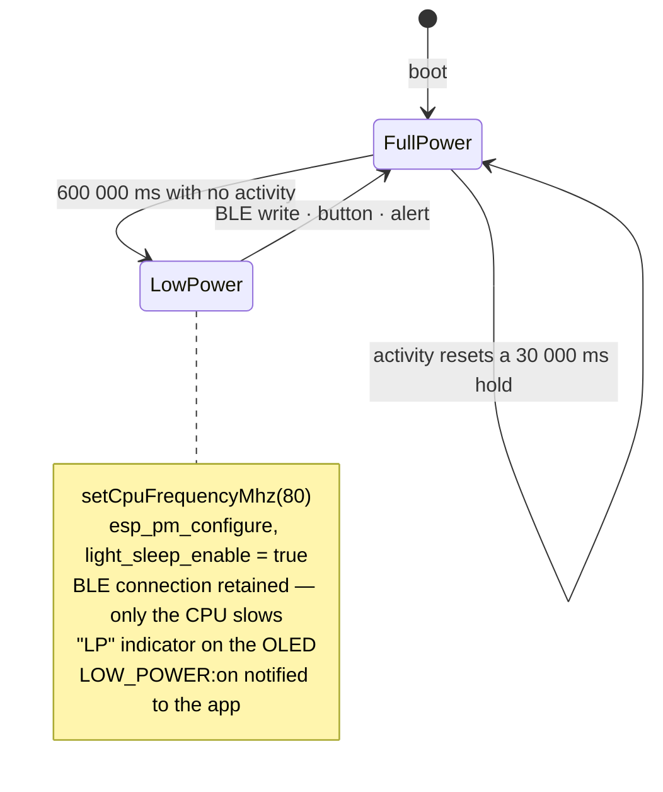

Deep sleep was considered and rejected: it drops the BLE connection, and a key
finder that must be woken before it can be found is not a key finder. Light
sleep with a reduced clock keeps the link up — the radio wakes the CPU for each
connection event — which is the only form of power saving compatible with the
product's purpose.

The 30-second full-power hold after any activity exists because the owner who
just pressed a button is likely to press another one, and a device that has to
climb back out of sleep between presses feels broken.

---

## 3.6 Communication protocol design

### 3.6.1 GATT structure

| Attribute | UUID | Properties |
|---|---|---|
| Primary service | `4fafc201-1fb5-459e-8fcc-c5c9c331914b` | — |
| Data / control characteristic | `beb5483e-36e1-4688-b7f5-ea07361b26a8` | read, write, notify |
| Ownership characteristic | `beb5483e-36e1-4688-b7f5-ea07361b26a9` | write, notify |

The service UUID is placed in the advertising packet, so the application can scan
with a service filter rather than matching on a name — more reliable, and it
works for a device whose name has been relegated to the scan response.

### 3.6.2 Command set (phone → keyholder)

| Frame | Bytes | Function |
|---|---|---|
| `FIND_KEY` | 8 | Sound the alert |
| `STOP` | 4 | Silence it |
| `GET_LOC` | 7 | Report the stored position |
| `ALERT_SET:<token>` | ≤ 18 | Choose the buzzer cadence |
| `PHONE_LOC:<lat>,<lng>` | **27** | The phone's position |
| `LOCATION_NAME:<place>` | ≤ 46 | What that position is called |
| `SET_DIST:<metres>` | ≤ 13 | The maximum allowance |
| `DIST_EXCEEDED:<metres>` | ≤ 18 | A breach, as measured by the app |
| `CLAIM:<ownerId>` | 38 | Take ownership |
| `AUTH:<ownerId>:<hmac>` | 70 | Answer a challenge |
| `UNCLAIM` | 7 | Release ownership |

### 3.6.3 Response set (keyholder → phone)

| Frame | Function |
|---|---|
| `READY` | Boot complete |
| `LOC:<lat>,<lng>` | The stored position |
| `BAT:<percent>` | Battery, or −1 on an implausible reading |
| `FIND_PHONE\|LOC:<lat>,<lng>` | The button was pressed — ring the phone |
| `ALERT:<token>` | The cadence actually in use |
| `AUTH_REQ:<nonce>` | Challenge |
| `AUTH_OK` / `AUTH_FAIL` | Verdict |
| `LOCKED:<seconds>` | Lockout in force |
| `CLAIM_OK:<key>` | Ownership granted; **73 bytes** |
| `DIST_THRESH:<m>` / `DIST_SET:ok:<m>` | The limit the board holds |
| `LOW_POWER:on` / `off` | Power state |
| `NAME:ok` / `NAME:invalid` | Place name stored, or rejected |

### 3.6.4 The MTU constraint

This is the single most consequential constraint in the protocol, and it is
arithmetic rather than opinion:

```
ATT MTU, default                   23 bytes
  less the 3-byte ATT write header
  = usable payload                 20 bytes

"PHONE_LOC:7.521834,4.526901"      27 bytes   ✗ cannot fit
"CLAIM_OK:" + 64 hex characters    73 bytes   ✗ cannot fit
```

Two frames essential to the system exceed the default payload. The MTU must
therefore be raised, and — critically — **on both sides**: the client's request
is negotiated against the server's own limit, so raising only the phone's
achieves nothing. The design specifies 247 bytes on each end
(`BleAuthParams.desiredMtu` in the application, `BLEDevice::setMTU(247)` in the
firmware).

A failure here is silent. A write that exceeds the negotiated payload is
truncated or split by the stack; no error is raised to the application, which
believes it has sent the frame. This is why the design also specifies the
reassembly rules of §3.6.5.

### 3.6.5 Frame reassembly rules

The keyholder must tolerate a frame arriving as more than one write.

| Rule | Reason |
|---|---|
| Append each write **untrimmed** to a buffer | Trimming each piece before joining eats the space at a split point, turning `LOCATION_NAME:Amphitheatre, OAU` into `…Amphitheatre,OAU` |
| Split on newline, if present | The unambiguous delimiter |
| Otherwise treat the buffer as complete, **except** for `PHONE_LOC:` without a comma | Bias towards obeying now: holding a frame back to see whether more arrives is how the next command gets glued onto the end of this one — a split place name would be stored as `AmphitheatreSET_DIST:50` |
| Flush a buffer that has not grown for 150 ms | The split frame whose remainder never came |
| Discard a buffer exceeding 512 bytes | No single malformed write may make the board permanently deaf |

The last two rules exist because of an observed failure: an earlier design held
anything beginning with `PHONE_LOC:` until a comma appeared and never reset when
the comma failed to arrive. One truncated frame therefore poisoned the buffer
permanently — every subsequent command was appended to the stuck fragment,
matched nothing, and the keyholder obeyed nothing further until it was
reconnected. Both guards are specified so that no single malformed write can
produce that state again.

### 3.6.6 Protocol dialects

Two variants exist, and the application supports both.

| | Ownership channel | Claim announcements |
|---|---|---|
| **Two-characteristic** | `…b26a9` | `STATUS:UNCLAIMED`, `AUTH_REQ:`, `AUTH_OK`, `AUTH_FAIL`, `LOCKED:` |
| **Single-characteristic** (the hardware built for this work) | none — the data characteristic | `AUTH:unpaired`, `AUTH:registered`, `AUTH:ok`, `AUTH:ok_unpaired`, `AUTH:denied` |

Supporting the second was not optional. The application withholds data writes
from a session it cannot confirm is authenticated; until it recognised these
plain-word announcements it never learned the claim state, so every write —
including the phone's position — was withheld, and the keyholder's location page
displayed no fix while the application held a perfectly good one.

### 3.6.7 Advertisement budget

```
Legacy advertising payload               31 bytes
  128-bit service UUID (AD type 0x07)    18
  flags (AD type 0x01)                    3
  AD header for the complete local name    2
  ─────────────────────────────────────────
  available for the name                   8 bytes
```

`FindMe` is six characters, inside the budget. A longer name is silently moved to
the scan response by the ESP32 BLE library, and such a device appears in a scan
list as a row with no name — which is how this constraint was discovered. The
eight-character ceiling is a specified design limit, held by an automated test.

Claim state is carried as one byte of service data in the **scan response**,
which has its own separate 31 bytes. One bit distinguishing owned from unowned
identifies nobody, and without it the application would offer pairing to devices
certain to refuse it.

---

## 3.7 Ownership and security design

### 3.7.1 Model

Ownership binds one keyholder to one phone. A claimed keyholder refuses every
data command from any other phone until its owner releases it.

| Parameter | Value |
|---|---|
| Owner identifier | 16 bytes, generated by the phone |
| Device key | 32 bytes, generated by the keyholder's hardware RNG |
| Nonce | 16 bytes, new for every connection |
| Authentication tag | HMAC-SHA256, truncated to 16 bytes (128 bits) |
| Challenge timeout | 10 s |
| Lockout | 3 failures → 30 s refusing connections |

### 3.7.2 Claim sequence

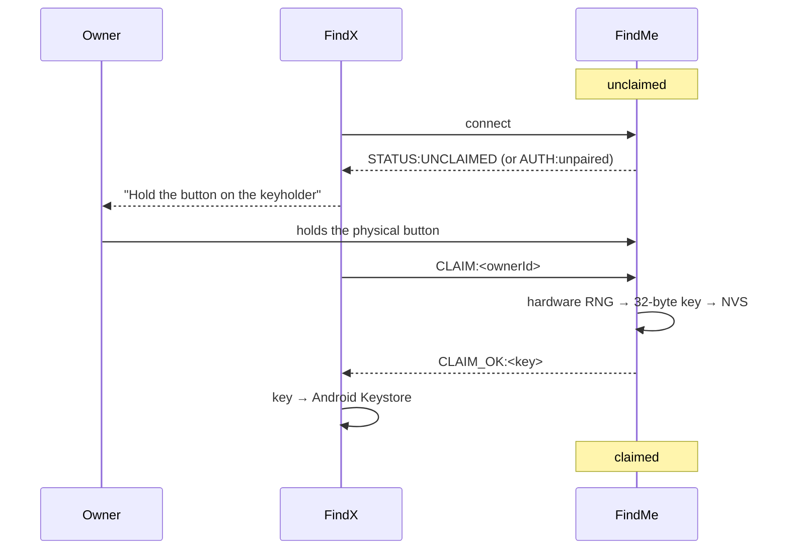

### 3.7.3 Authentication sequence

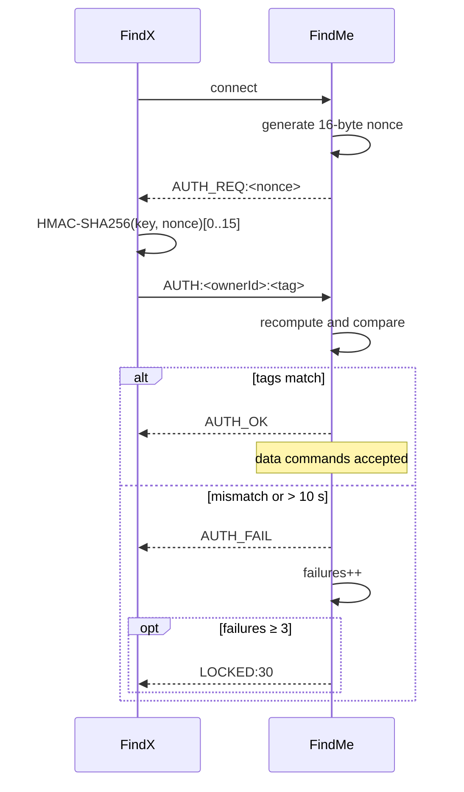

### 3.7.4 Design rationale

**Why the physical button, and no passphrase.** A device with no keypad cannot
accept a user-chosen secret, so any secret must be printed on the enclosure or
packed in the box — in which case everyone holding the device has it. Since
anyone holding the device can press the button in any case, the button is not a
weaker proof of possession than a printed secret; it is the *same* proof, with no
secret that can leak. What it buys is that **ownership cannot be taken
remotely.**

**Why challenge–response and not a stored password.** The key crosses the air
exactly once, in `CLAIM_OK:`, at the moment of claiming. Every subsequent
connection proves knowledge of it without transmitting it, and a fresh nonce
each time makes a recorded exchange useless for replay.

**Why the key is generated on the device.** A key derived from anything the
phone knows would be recoverable from the phone. Two keyholders claimed by the
same phone have unrelated keys.

**Why lockout, given a 128-bit tag.** Not to stop a brute force — the arithmetic
does that. It stops a nearby attacker draining a small battery with an endless
sequence of connect-and-fail cycles, which is the real denial of service
available against this class of device.

A full threat model, including what this design does **not** defend against, is
in [`docs/SECURITY_MODEL.md`](SECURITY_MODEL.md).

---

## 3.8 Algorithm design

### 3.8.1 Distance estimation

The log-distance path-loss model:

$$RSSI = TxPower - 10 \, n \log_{10}(d)$$

solved for distance:

$$d = 10^{\dfrac{TxPower - RSSI}{10n}}$$

| Parameter | Value | Meaning |
|---|---|---|
| `TxPower` | −59 dBm | RSSI measured at exactly 1 m |
| `n` | 2.5 | Path-loss exponent; 2.0 is free space, indoors is 2.5 – 4 |
| `maxReportedMetres` | 30.0 | Beyond this the estimate is noise and is not shown as a number |

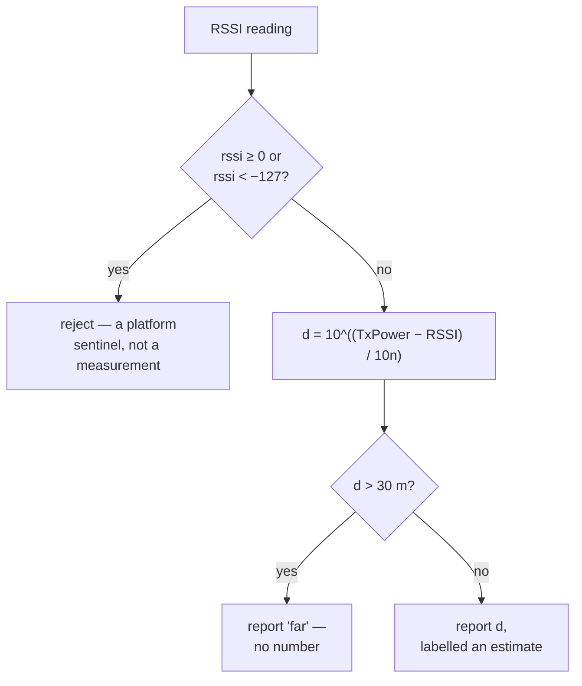

Both constants are measurable from Settings, because `TxPower` in particular is a
property of the individual board and its enclosure rather than of the model. The
design treats the output as a *relative* indicator — warmer, colder — which is
what finding an object in a room actually requires, and the interface says so
rather than implying a survey-grade figure.

**Calibration design.** The constants are measured statistically rather than
entered by hand. The owner states which of three distances they are standing at,
and the application takes twenty-four raw RSSI readings over about six seconds and
keeps the median; rearranging the model for its reference term,
$TxPower = RSSI + 10\,n \log_{10}(d)$, converts that median into the one-metre
reference. The median rather than the mean, because multipath produces occasional
readings more than ten decibels from the truth and a mean carries them into the
answer in proportion to how wrong they are.

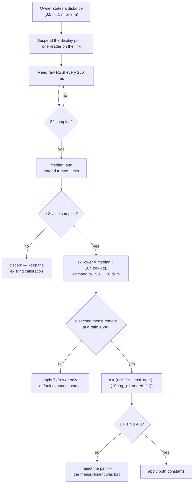

Taking a distance argument rather than insisting on one metre is what makes the
procedure usable: nobody holds a measured metre, but most people can stand at a
doorway they know is three metres off, and the logarithm corrects for it exactly.
Sampling two distances eliminates the reference term by subtraction and recovers
the exponent as well, which fits the model to the room rather than only to the
board. The sampler reads the radio directly rather than the smoothed display feed,
because that feed is already a rolling median and a median of medians would hide
the spread the measurement exists to report. Manual sliders remain as an override.

### 3.8.2 Maximum allowance versus proximity threshold

Two distinct distances, which an earlier design conflated:

| Setting | Effect |
|---|---|
| **Proximity threshold** | Phone notification only. Advisory: "your keys are getting far away." |
| **Maximum allowance** | The keyholder's buzzer sounds. The hard limit. |
| **Half-allowance warning** | A phone notification at half the allowance, as an early warning. |

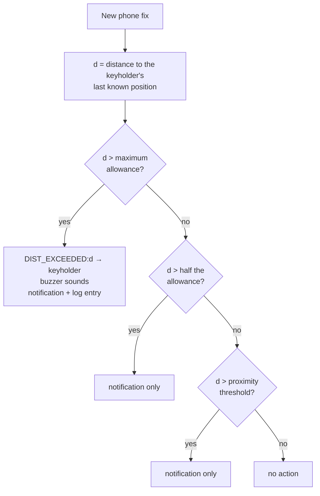

`DIST_EXCEEDED:` is kept distinct from `FIND_KEY` deliberately. `FIND_KEY` means
"the owner is looking for these keys and pressed a button"; `DIST_EXCEEDED:`
means "these keys have left the area their owner allowed". Different text on the
keyholder's screen, a different entry in the log, and only one of them was asked
for at that instant. Both are ended by `STOP`.

The measurement is performed by the application because only the application
holds both positions.

### 3.8.3 Automatic reconnection

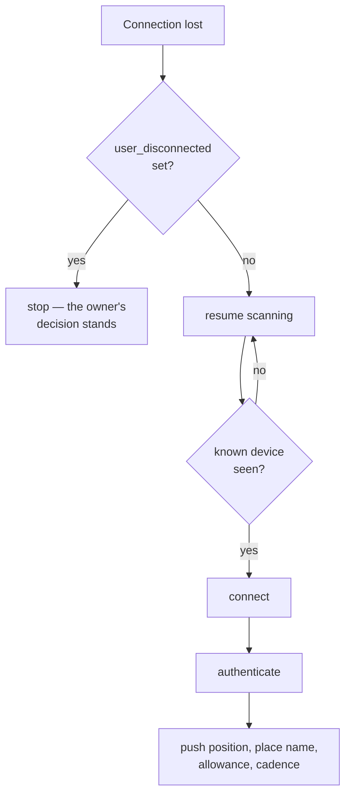

The `user_disconnected` flag is set **before** the radio is touched, because
`disconnect()` causes the connection-state listener to fire and that path resumes
hunting by default; the flag must already be standing in front of it. It is
persisted to storage, so it survives a reboot — which is what makes the rule
coherent across a power cycle: **reconnect always, except after a disconnection
the owner has not undone.**

### 3.8.4 Boot reconnection

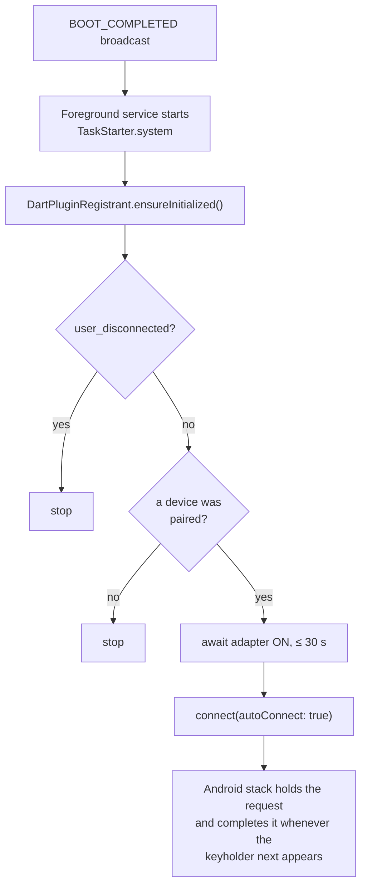

`autoConnect` rather than a scan, because a reboot is the moment the keyholder is
*least* likely to be in range — the phone may be charging in another room. A scan
would find nothing and give up; the platform stack holds the request open at no
cost in application-side battery.

### 3.8.5 Position push

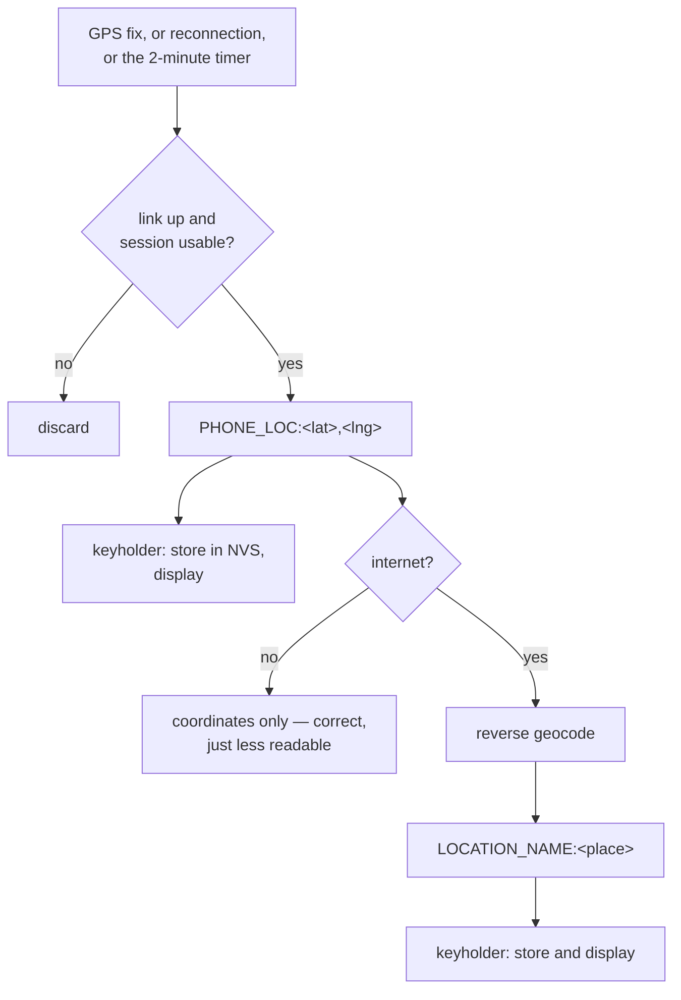

The name is sent after the coordinates and never instead of them: the lookup
needs internet and may never return, and a keyholder told a name but no position
would have nothing to fall back on.

"Session usable" means authenticated, **or** unclaimed, **or** a board with no
ownership characteristic at all — the third case matters, because there is no
handshake to complete on such a link, and waiting for one to succeed means
waiting forever.

---

## 3.9 Application design

### 3.9.1 Use-case diagram

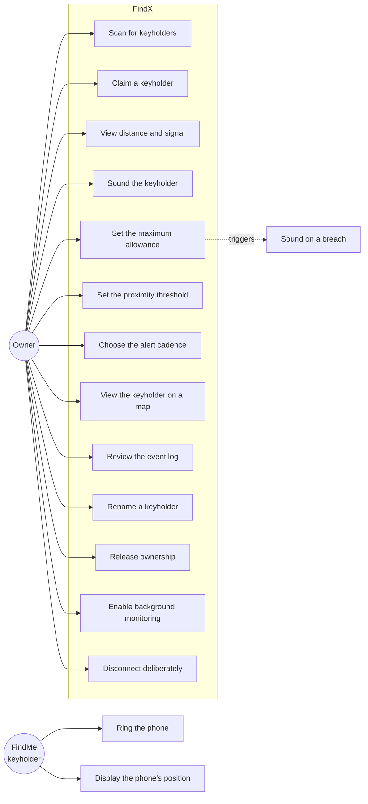

### 3.9.2 Screen flow

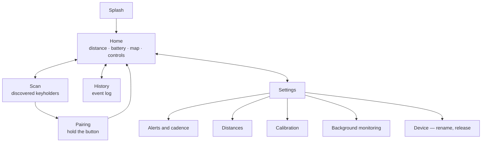

### 3.9.3 Data-flow diagram, level 0 (context)

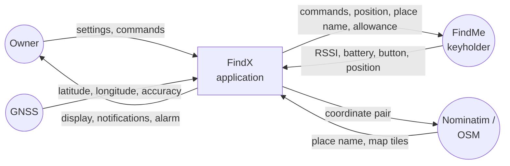

### 3.9.4 Data-flow diagram, level 1

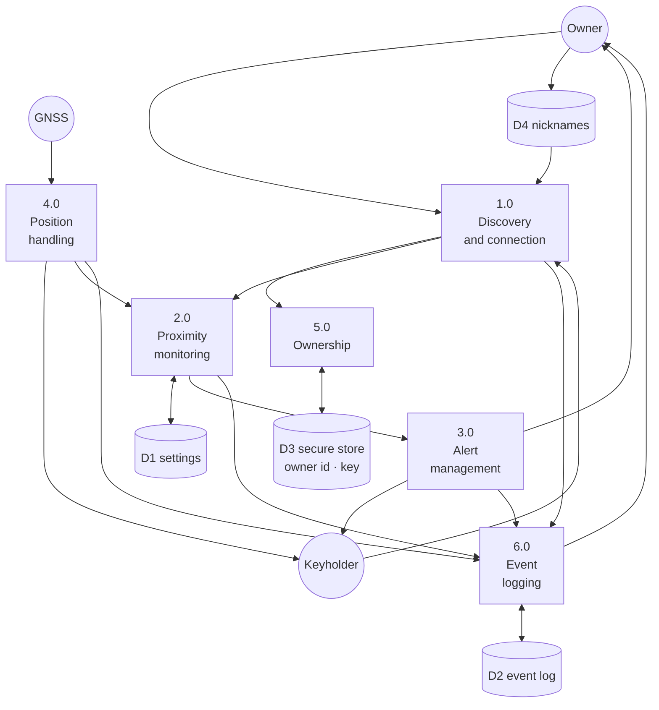

### 3.9.5 Persistent data design

There is no database. Two stores, split by sensitivity.

**Android Keystore, via `flutter_secure_storage`**

| Key | Content |
|---|---|
| owner identifier | 16 bytes, hex |
| device key | 32 bytes, hex, per claimed device |

**`SharedPreferences`**

| Key | Content |
|---|---|
| `last_device_id`, `last_device_name` | The paired keyholder |
| `user_disconnected` | The sticky deliberate-disconnect flag |
| `background_running_enabled`, `background_permission_asked` | Background monitoring |
| alert pattern, tone, vibration | Alerting preferences |
| proximity threshold, maximum allowance | Distances |
| `txPower`, path-loss exponent | Calibration |
| event log | Serialised list, bounded by the retention setting |
| nicknames, keyed by BLE address | **Never transmitted** — PR-2 |

The split is the design: nothing in `SharedPreferences` can be used to
impersonate the owner to a keyholder. A leaked preferences file discloses
history, which is bad, but not control.

### 3.9.6 Event-log design

Each entry carries a type, a timestamp, the device, and — where the event has a
position — the coordinates and the resolved place name.

The log shows the **day** as well as the time, which sounds trivial and is not:
"14:32" is useless a day later, and the log's whole purpose is to be read after
the fact. Entries name the **place** rather than an IP address, for the same
reason.

Retention is bounded and owner-selectable. An unbounded log on a 3 GB phone
(NFR-1) is a slow memory leak with a pleasant name.

---

## 3.10 Firmware design

### 3.10.1 Main loop

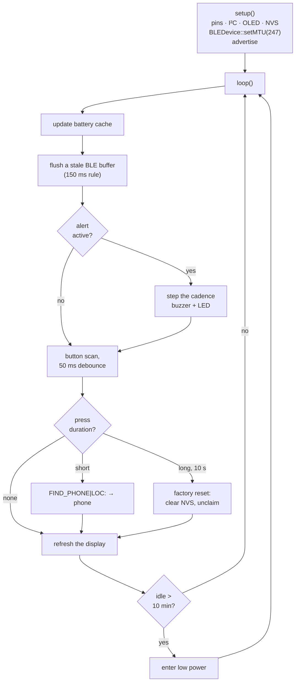

### 3.10.2 Command dispatch

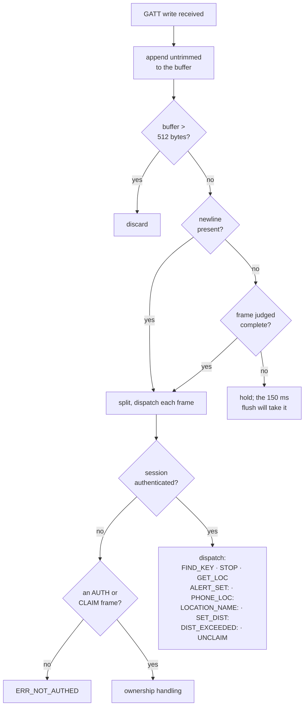

### 3.10.3 Display design

72 × 40 pixels is 2,880 pixels in total, so every element must earn its place.

| Page | Content |
|---|---|
| Status | Connection state, battery percentage, `LP` when resting |
| Location | Place name if known, otherwise coordinates |
| Alert | Why it is sounding — a search, or a breach |
| Distance | The maximum allowance currently held |

Full-buffer mode (`U8G2_..._F_HW_I2C`) is used: the whole frame is composed in
RAM and transferred once, which removes the tearing visible with page mode. The
cost is roughly 360 bytes of RAM, which this chip has.

Text is **truncated, never wrapped** — a wrapped place name would push the
battery indicator off a 40-pixel-high screen. Twelve characters is the practical
limit for the location line.

### 3.10.4 Alert cadence table

```c
{ "CONT",   60000UL, 0UL, 1, 0UL },   // index 0 — continuous
{ "STEADY",   250UL, 0UL, 1, 250UL }, // index 1 — steady beeping (default)
```

The **index**, not the name, is persisted to NVS. Reordering the table therefore
changes the behaviour of every device already in the field, so row order is a
specified design constraint rather than an implementation detail.

The application sends a **token** (`ALERT_SET:STEADY`) rather than raw
millisecond values, so that retuning a pattern is a firmware change alone. Had
the application sent `ALERT_SET:250:250:1`, the two sides would have had to agree
on timing for ever.

Two patterns rather than six: the owner asked for fewer, and on a single-tone
active buzzer the distinctions between six patterns are not audible enough to be
worth the setting.

### 3.10.5 Why the buzzer is driven with `digitalWrite` only

The buzzer is an **active** element: it contains its own oscillator. `tone()`
imposes a second frequency on top of the element's own, and the result is a thin
rattle rather than a loud beep. This is specified in the design because it is the
sort of thing that gets "fixed" by a later maintainer reaching for `tone()`.

---

## 3.11 Design decisions reversed during development

Recording these is more useful than presenting the final design as though it
arrived whole.

| Decision | Reversed to | Why |
|---|---|---|
| GPS module (NEO-6M) in the keyholder | No GPS; positions pushed from the phone | A receiver in the keyholder can only be read over a live BLE link, which is exactly what is absent the instant the keys are lost. The phone's receiver is available then. |
| Wi-Fi provisioning, with credentials in the keyholder's NVS | Removed entirely | A frequently-lost object with readable flash is the worst place to keep a network password. Wi-Fi and BLE also share one antenna on the C3, roughly doubling average current. |
| Cloud reporting of events | Removed | Creates the one asset — a movement history held by an operator — that this design otherwise does not have. |
| Advertised name changes on claiming | One generic name always | The name change was itself an identifier, and a followable one. |
| Six alert patterns | Two | Not distinguishable on a single-tone active buzzer. |
| Maximum allowance and proximity threshold as one setting | Two settings | One should sound an alarm; the other should only advise. Merging them meant the owner could not have both. |
| Advertised name `BLE-Keyholder` / `Find Me` | `FindMe` | Thirteen and seven characters respectively against an eight-byte budget; the first appeared in scan lists with no name at all. |

---

## 3.12 Summary

This chapter has presented the analysis and design of the FindX/FindMe system: an
iterative methodology chosen because three of the project's most consequential
constraints were only discoverable by building; a layered application
architecture with a single Bluetooth service instance and a deliberately
near-empty background isolate; a hardware design on the ESP32-C3 with no GPS
receiver and no Wi-Fi, both removed for reasons given; a Bluetooth protocol whose
central constraint is the 20-byte default ATT payload; an ownership scheme rooted
in physical possession of a button rather than in any secret that could leak; and
a set of privacy requirements, derived from the documented failures of commercial
trackers, that constrain the design more tightly than any functional requirement
does.

Chapter Four presents the implementation of this design and the results of
testing it.
